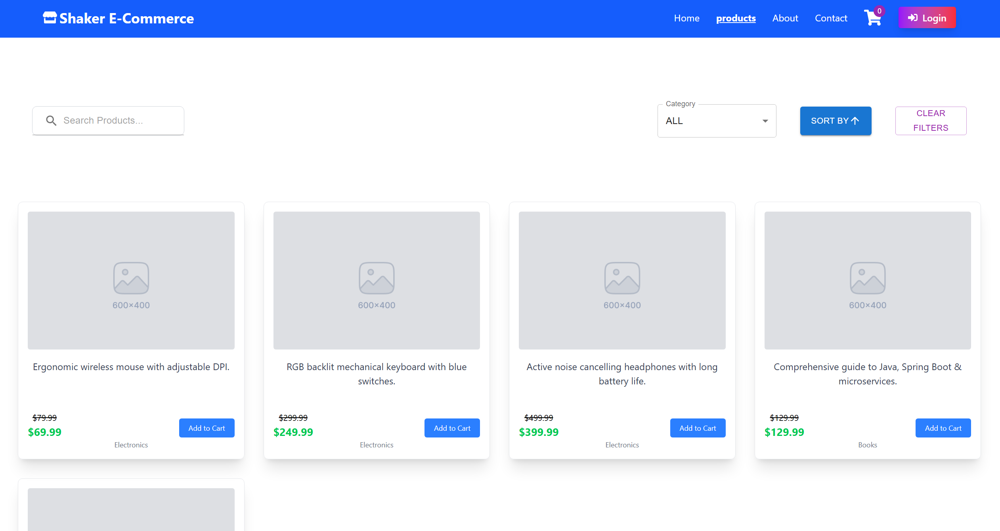
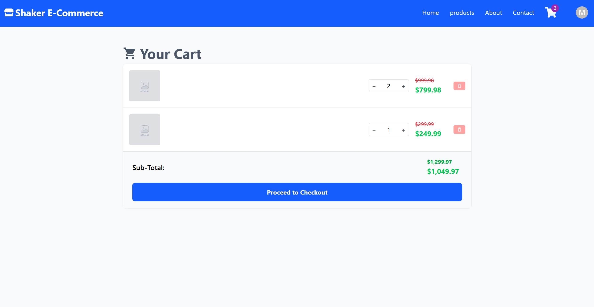
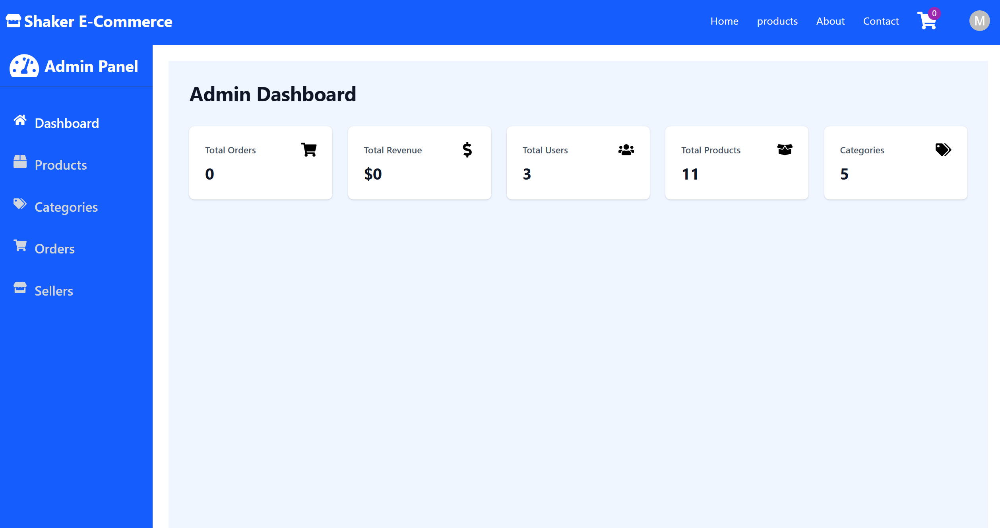
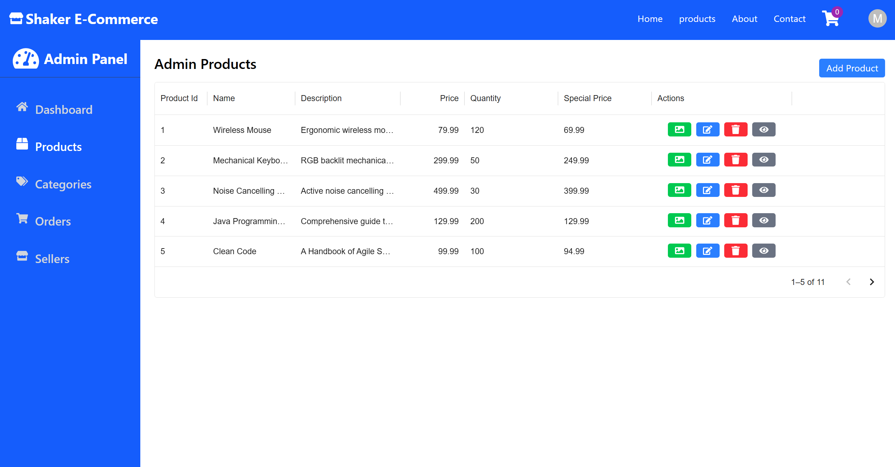

# ShakerECommerce Frontend

ShakerECommerce is a modern, responsive React-based frontend application built for an e-commerce platform.
It provides a seamless shopping experience with intuitive product browsing, secure checkout, and real-time order management.

The frontend integrates with the ShakerECommerce backend API to deliver a complete end-to-end e-commerce solution with Stripe payment processing.


## Screenshots & Demo

### Project Images






### Demo Video

[Watch Full Project Demo for User](https://www.linkedin.com/posts/mshaker98_fullstackdeveloper-springboot-reactjs-activity-7405548419911708672-RIpv)


## Features

*   **Product Catalog:** Browse and search products with filtering by category and dynamic sorting options.
*   **Shopping Cart:** Add, remove, and manage items with persistent cart state management.
*   **User Authentication:** Secure login and registration with JWT-based session handling.
*   **Checkout Flow:** Seamless checkout process with Stripe integration for secure payments.
*   **Order History:** View past orders and track order status in real-time.
*   **Responsive Design:** Mobile-first design that works across all devices and screen sizes.
*   **Admin Dashboard:** Manage products, categories, and view customer orders (admin-only access).

## Technical Stack

*   **React 18** with functional components and hooks.
*   **Redux Toolkit** for state management.
*   **Axios** for API communication.
*   **Tailwind CSS** for styling and responsive design.
*   **Stripe.js** for payment integration.
*   **React Router** for navigation.

## Running the Project

### Local Setup

1.  **Install Dependencies:**
    ```bash
    npm install
    ```
2.  **Configure Environment:** Create a `.env` file and add your API endpoint:
    ```
    REACT_APP_API_URL=http://localhost:8080/api/v1
    REACT_APP_STRIPE_PUBLIC_KEY=your_stripe_public_key
    ```
3.  **Start Development Server:**
    ```bash
    npm start
    ```

### Docker

```bash
docker build -t shaker-ecommerce-frontend .
docker run -p 3000:3000 shaker-ecommerce-frontend
```


